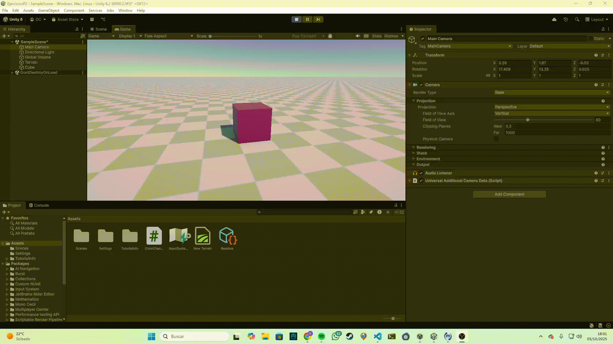
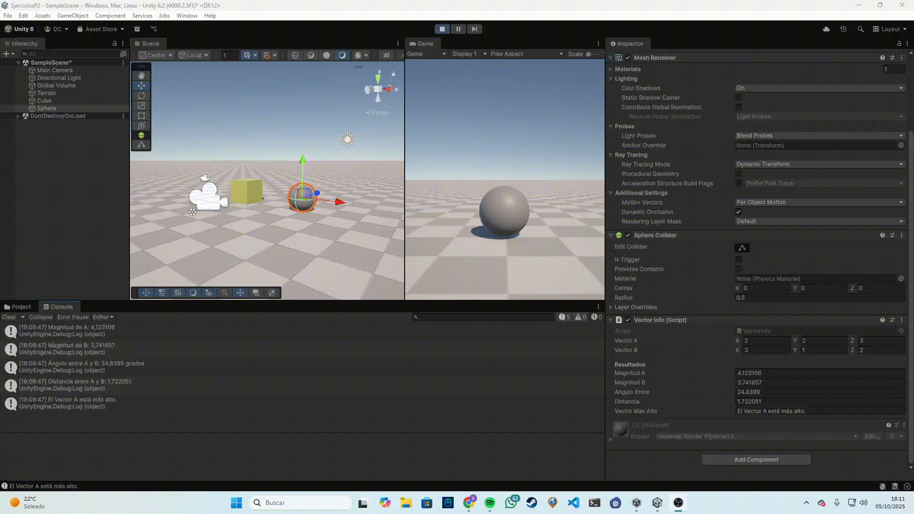
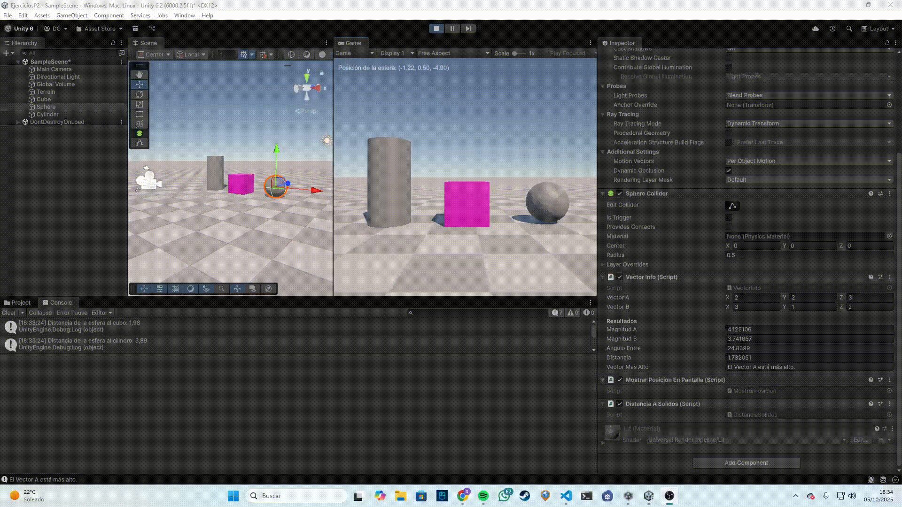
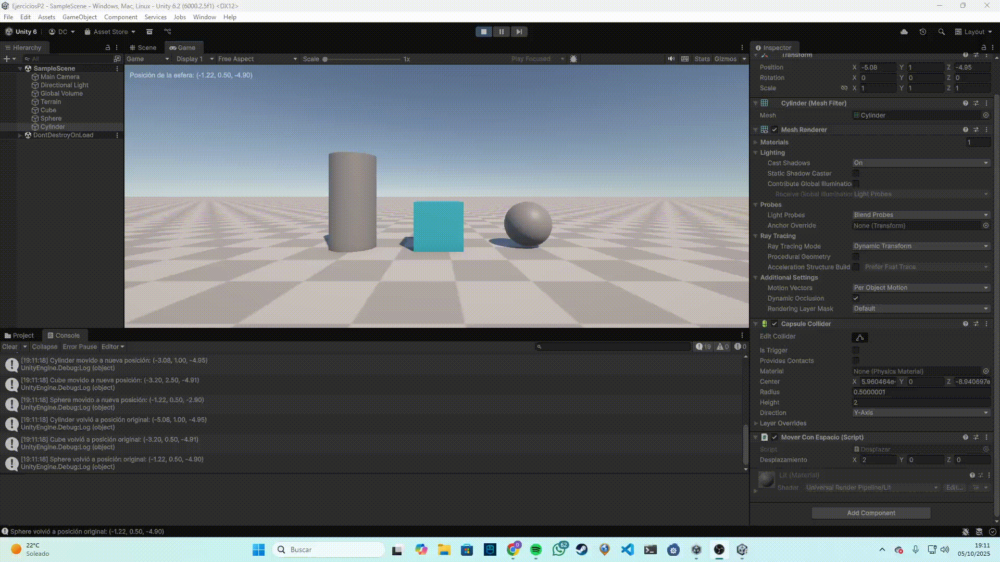
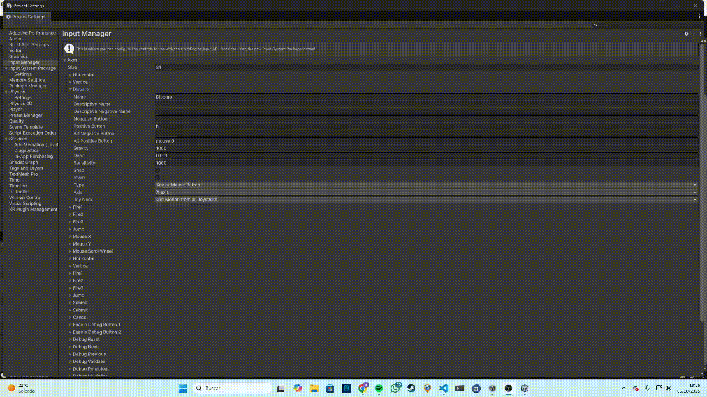

# Ejercicios Scripts
## Ejercicio 1
Hice que un objeto cambiara de color aleatoriamente cada cierto número de frames. [Enlace al Script](ColorChanger.cs)

## Ejercicio 2
Creé dos vectores y mostré en consola su magnitud, ángulo, distancia y cuál estaba más alto. [Enlace al Script](VectorInfo.cs)

## Ejercicio 3
Mostré en pantalla la posición de la esfera usando su componente Transform. [Enlace al Script](MostrarPosicion.cs)

## Ejercicio 4
Hice que la esfera mostrara la distancia a la que se encuentran el cubo y el cilindro. [Enlace al Script](DistanciaSolidos.cs)

## Ejercicio 5
Configuré un desplazamiento para cada objeto que se aplica al pulsar la barra espaciadora. [Enlace al Script](Desplazar.cs)

## Ejercicio 6
Mostré en consola la velocidad multiplicada por el eje correspondiente cuando se presionan las flechas. [Enlace al Script](CuboControl.cs)

## Ejercicio 7
Mapeé la tecla H a una función de disparo mediante el Input Manager. [Enlace al Script](Disparo.cs)

## Ejercicio 8
Hice que el cubo se moviera en la dirección indicada por un vector configurable y una velocidad. [Enlace al Script](CuboMovimiento.cs)

## Ejercicio 9 y 10
Moví el cubo con las flechas y la esfera con las teclas WASD. Adapté el movimiento para que fuera proporcional al tiempo transcurrido entre frames. [Enlace al Script1](CuboMove.cs) [Enlace al Script2](EsferaMove.cs)

### Ejercicio 11
Hice que el cubo se moviera hacia la esfera sin importar la distancia entre ambos. [Enlace al Script](CuboSigueEsfera.cs)

### Ejercicio 12
El cubo siempre avanza mirando hacia la esfera, girando automáticamente hacia ella. [Enlace al Script](CuboMiraEsfera.cs)

### Ejercicio 13
Hice que el cubo avanzara hacia adelante y girara con el eje horizontal. [Enlace al Script](MovimientoConRotacion.cs)

